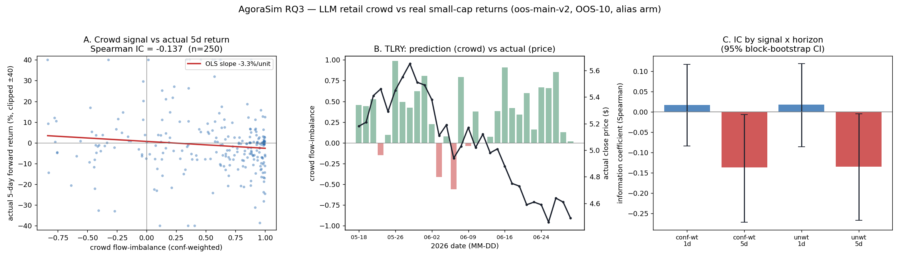
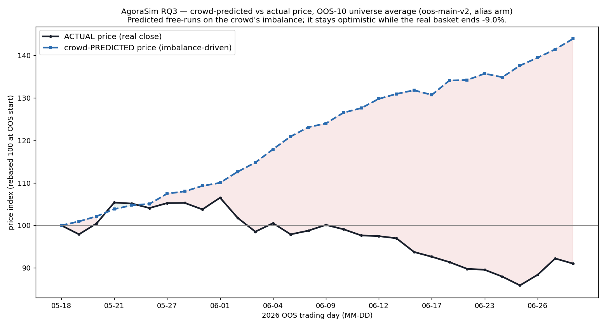

# AgoraSim — Results

Generated (UTC): 2026-07-05. Run of record: `oos-main-v2`. All numbers reproduce from the
GCS run artifacts + committed manifests (see Reproducibility).

## 1. What this is

AgoraSim simulates a crowd of small (1.5B–3.5B) instruct LLMs as retail investors making one
daily buy/sell/hold decision per small-cap stock, and asks whether the **aggregate simulated
order flow carries information about the real next-period return** (RQ3). It is a
proof-of-concept and a research instrument, not a trading system (PLAN §1). Prices in the
realism track are endogenous; the simulated price never needs to track the real price.

## 2. Method (frozen before inference)

- **Universe (GATE G1).** OOS-10, point-in-time selected on 2024-12-20, window 2025-01-02 →
  2026-06-30: NVNI TLRY EDIT CHPT BLNK FRSX TPET OGI CCO ICCM. Retail-attention rank
  `z(news_60d) + z(dollar_volume_spike) + 0.5·z(1/price)` after common-share / price / market-cap
  filters. Bars + news snapshotted and SHA-256-hashed (docs/G1_SNAPSHOT_MANIFEST.json); a
  10-prompt leakage spot-check found zero look-ahead (docs/G1_LEAKAGE_SPOTCHECK.md).
- **Models (GATE G0/G2).** Two families survived the ≥99% valid-JSON gate: Qwen (2.5-1.5B,
  2.5-3B) and Phi-3.5-mini. SmolLM2 was dropped (0.96 valid-JSON). Throughput 1985–4859
  decisions/hour on a single spot T4 with guided JSON decoding (docs/G0_THROUGHPUT.md,
  docs/G2_REPORT.md).
- **Contamination (A-202).** Post-cutoff price-recall probes returned 0.00 recall for every
  (model, ticker) in both named and alias arms → the OOS window is empirically out-of-sample;
  no exclusions (docs/G2_CONTAMINATION.md).
- **Run.** `oos-main-v2`: 10 tickers × 45 agents (15 per model × 3 models) × 30 trading days,
  **alias arm** (ticker label anonymized), guided decoding. 13,500 decisions, **99.94%
  valid-JSON**. Per (ticker, day) the crowd's confidence-weighted and unweighted
  `flow_imbalance` is the prediction signal; a uniform-price call auction is the realism track.
- **Statistics (P5).** Signal vs realized forward real return, pooled over ticker-days:
  information coefficient (Spearman), hit rate, moving-block bootstrap CI, Diebold-Mariano vs a
  5-day momentum baseline (D-09), and Deflated Sharpe against the 4 registered trials (D-11).

## 3. RQ3 result (docs/P5_STATS.md)

| signal x horizon | ticker-days | IC | IC 95% CI | hit rate | DM vs mom5 (p) |
|---|---:|---:|---|---:|---:|
| imbalance_cw, 1d | 290 | +0.017 | [−0.084, +0.117] | 0.455 | −0.96 (0.34) |
| imbalance_cw, 5d | 250 | **−0.137** | **[−0.271, −0.007]** | 0.396 | 0.32 (0.75) |
| imbalance_uw, 1d | 290 | +0.018 | [−0.086, +0.119] | 0.462 | −1.12 (0.26) |
| imbalance_uw, 5d | 250 | **−0.135** | **[−0.267, −0.005]** | 0.388 | 0.43 (0.66) |

*Figure (`scripts/p6_plot.py --run-id oos-main-v2`).* **A** — pooled crowd signal vs actual
5-day forward return (Spearman IC −0.137); the fit slopes down. **B** — TLRY: the crowd stays
net-bullish (green bars) through a −20% price slide (black line), the contrarian pattern in one
name. **C** — IC by signal × horizon with 95% block-bootstrap CIs: ≈0 at 1 day (CI spans zero),
≈−0.14 at 5 days (CI excludes zero).

*Figure (`scripts/p6_plot_prices.py --run-id oos-main-v2`).* OOS-10 median price index, rebased
to 100 at the window start. The **crowd-predicted** path (free-run of the daily imbalance,
scaled by each name's realized volatility) climbs to ~+44%, while the **actual** basket ends
~−9%. The widening gap is the crowd's price-forecast error: it stays persistently optimistic
as the real small caps drift down — the visual form of the +0.5 mean imbalance and the
contrarian 5-day IC.

**Reading.**
1. **No 1-day predictability.** IC ≈ +0.02 with a CI straddling zero and hit rate < 0.5. The
   crowd tells you nothing about tomorrow.
2. **A small, statistically-detectable *contrarian* tilt at 5 days.** IC ≈ −0.14 with a 95% CI
   that excludes zero for both signal variants: days with a higher crowd buy-imbalance are
   followed by *lower* 5-day returns. This matches the retail-crowd-as-fade-indicator prior —
   the LLM crowd inherits a strong optimism bias (mean imbalance +0.5; it is almost always net
   long), and leaning hardest into a name preceded underperformance in this window.
3. **It does not beat momentum.** The Diebold-Mariano test vs a 5-day momentum baseline is
   insignificant at every horizon (p ≥ 0.26) — the crowd signal carries no *incremental*
   directional information over trivial price momentum.

## 4. Honest limitations

- **Single recent regime.** 30 trading days across 10 correlated small caps (one 2026 window).
  The −0.14 5-day IC is suggestive, not robust; it could be an artifact of these names trending
  down while the crowd stayed bullish. A multi-window / longer run is needed before any claim.
- **Not tradeable.** Even at face value the effect is tiny, at a horizon and in names that are
  hard/expensive to trade — exactly the non-goal stated up front (PLAN §1).
- **Alias-arm leakage.** The alias arm hides the ticker label but real news headlines still name
  the company (a rationale referenced "tilray"), so the anonymization is partial. Contamination
  probes nonetheless showed zero post-cutoff price recall, bounding the memorization risk.
- **CALIB track (RQ1 realism / RQ2 fidelity) not run.** It requires the Robintrack holder
  archive (robintrack.net is defunct); code + universe rules are complete and gated behind data
  acquisition (P3-prep).

## 5. What did work (the PoC claims)

- Small LLMs produce near-perfectly-structured decisions at scale (99.94% valid-JSON) under
  guided decoding on commodity T4 GPUs — the engineering premise holds.
- The full point-in-time, leakage-controlled, contamination-checked, manifest-reproducible
  pipeline runs end-to-end on ~$8 of spot compute.
- The crowd exhibits a measurable, quantified **optimism/herding bias**, which is itself the
  kind of behavioral finding the instrument is built to surface.

## 6. Reproducibility (GATE G5)

- Frozen inputs: `gs://…/agorasim/snapshots/g1/` (hashed in docs/G1_SNAPSHOT_MANIFEST.json).
- Raw decisions + run manifests: `gs://…/agorasim/runs/oos-main-v2/{raw,manifests}/`.
- Signals: `gs://…/agorasim/runs/oos-main-v2/signals.jsonl` (regenerate:
  `python scripts/collect_sim_phase.py --run-id oos-main-v2`).
- Statistics: `python scripts/p5_stats.py --run-id oos-main-v2 --n-trials 4` → docs/P5_STATS.md.
- Registered trials: docs/TRIALS.md (n=4, DSR-deflated). Gates: docs/G0_*, G1_*, G2_*.
